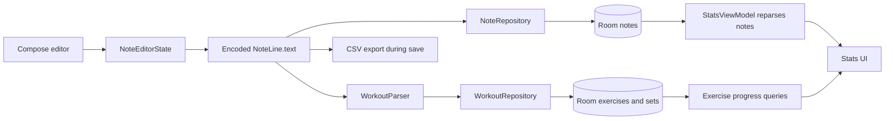
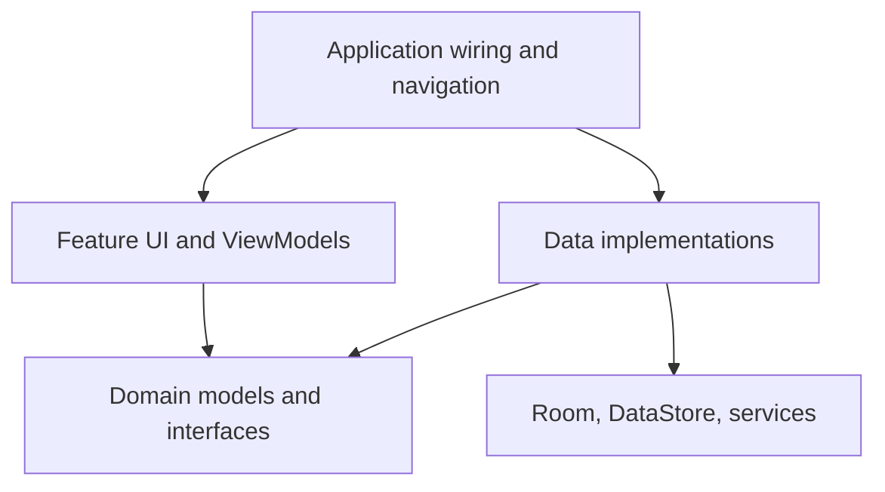
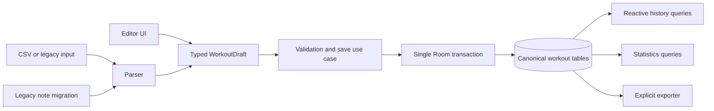

# GymTrack Architecture

**Status:** Current-state audit and target direction  
**Baseline:** `master` at `558398d069196d9e7400883e5d88a40615a4a2d0`

## Purpose

This document explains how GymTrack currently works, where responsibilities are mixed, and the intended dependency and data-flow direction. It is not permission for a large rewrite. Changes should be incremental, issue-driven, and migration-safe.

## Current stack

| Concern | Implementation |
|---|---|
| Platform | Native Android |
| Language | Kotlin |
| UI | Jetpack Compose and Material 3 |
| Navigation | Navigation Compose |
| Primary storage | Room |
| Settings | Preferences DataStore |
| Timer | Android foreground service |
| Concurrency | Coroutines and Flow |
| Charts | Custom Compose Canvas charts |
| Dependency wiring | Manual construction and ViewModel factories |
| Tests | Limited JUnit and Android template tests |

## Current package shape

```text
com.example.gymtrack/
├── MainActivity.kt
├── NavigationHost.kt
├── core/
│   ├── data/
│   ├── services/
│   ├── ui/
│   └── util/
└── feature/
    ├── editor/
    ├── home/
    ├── settings/
    └── stats/
```

The repository is already partly feature-oriented. The main problem is not the number of modules. It is that domain models, Room entities, parsing, import/export, ViewModel logic, and Compose state cross boundaries freely.

## Current runtime pipeline



### Current characteristics

- The note text is the original record.
- Absolute times and flags are embedded using invisible Unicode separators.
- Notes are parsed into exercise and set tables.
- Some statistics query normalized set rows.
- Other statistics parse note text again.
- Every application start reparses all notes to rebuild statistics.
- Autosave can also parse data and export CSV.

This creates multiple representations of one workout and multiple partially overlapping pipelines.

## Main architectural risks

### Data-loss migration fallback

Room uses destructive migration fallback. Unsupported schema changes can erase local data. Production builds must use explicit migrations and migration tests.

### Multiple sources of truth

Workout information exists in encoded text, normalized rows, and statistics calculated directly from text. These representations can disagree.

### Hidden-character persistence

Zero-width separator characters are implementation details embedded in user data. Copying, editing, importing, debugging, and future migration become fragile.

### Save path side effects

A save can write the note, parse it, replace sets, and write CSV. Autosave should preserve a draft safely; export and expensive derived work should be separate operations.

### Identity coupled to timestamps

The note timestamp acts as primary key, workout ID, and time. Stable identity, creation time, start time, and display time should be separate fields.

### Process-global timer state

The timer service exposes companion-object state. Restoration after process death and ownership of the active workout are not explicit.

## Architectural objective

Use a single-module, layered, feature-oriented architecture with one canonical persisted workout model and explicit dependency direction.

A Gradle-module split is not currently justified. Package boundaries should be enforced first.

## Target package structure

```text
com.znypr.gymtrack/
├── app/
│   ├── GymTrackApplication.kt
│   ├── AppContainer.kt
│   └── navigation/
├── domain/
│   ├── model/
│   ├── repository/
│   └── service/
├── data/
│   ├── local/
│   │   ├── database/
│   │   │   ├── entity/
│   │   │   ├── dao/
│   │   │   └── migration/
│   │   └── settings/
│   ├── repository/
│   ├── importexport/
│   └── mapper/
├── feature/
│   ├── workouts/
│   ├── editor/
│   ├── stats/
│   └── settings/
└── core/
    ├── ui/
    ├── time/
    ├── logging/
    └── testing/
```

## Dependency direction



Rules:

- Compose UI does not access DAOs.
- ViewModels depend on repository interfaces rather than Room entities.
- Room entities do not leave the data layer.
- Parser output uses immutable domain models.
- Import/export is outside Compose and ViewModels.
- Domain parsing and calculations are pure Kotlin and unit-testable.
- Android `Context` is accessed through application-safe abstractions.

## Proposed canonical model

```text
Workout
- id
- startedAt
- endedAt
- categoryId
- title
- learnings
- rawDraftText (temporary compatibility field)
- createdAt
- updatedAt

WorkoutExercise
- id
- workoutId
- exerciseId
- position
- mode: bilateral | unilateral | superset

WorkoutSet
- id
- workoutExerciseId
- position
- weight
- repetitions
- unit
- performedAtOffsetSeconds
- rpe or rir (optional later)

Exercise
- id
- canonicalName
- aliases
- muscleGroup (optional)

Category
- id
- name
- color
- position
- isBuiltIn
```

The editor may remain note-like, but it should edit a typed `WorkoutDraft` instead of parallel text, timestamp, and flag arrays.

## Target pipeline



Expected results:

- Room is the canonical source of truth.
- Parsing happens at input, import, or migration boundaries.
- One transaction saves a complete workout.
- Statistics read typed data.
- Export is explicit or scheduled, not part of every autosave.
- Startup does not rebuild all derived data.

## Dependency injection

Do not introduce Hilt by default. Start with a small `AppContainer` that owns:

- the database;
- repository implementations;
- settings storage;
- parser;
- import/export services;
- a clock abstraction where deterministic tests need it.

Hilt can be reconsidered when manual wiring becomes a demonstrated maintenance problem.

## Migration strategy

1. Freeze non-essential feature work.
2. Add regression tests around the current parser, encoding, import/export, and database.
3. Replace destructive migration fallback.
4. Add normalized tables beside the legacy notes table.
5. Backfill normalized data from legacy notes.
6. Verify counts and representative workouts during migration.
7. Switch statistics and history reads to normalized data.
8. Switch the editor save path to typed data.
9. Retain legacy raw text for one compatibility release.
10. Remove legacy models and encoding only after upgrade evidence is stable.

## Initial cleanup candidates

Deletion requires usage search, compilation, and tests. Likely candidates include:

- `FullProjectCode.txt`;
- template unit and instrumentation tests;
- superseded editor and note-card components;
- duplicate legacy note/domain models;
- disconnected import helpers;
- duplicate color helper functions;
- unused YCharts dependency;
- duplicate Room compiler, Material 3, Core KTX, and icon dependencies;
- unused generated resource colors.

Cleanup should be isolated from behavior changes.

## Architecture Decision Records

Create an ADR when a change:

- changes the canonical data model;
- changes persistence or backup strategy;
- changes import/export compatibility;
- introduces or removes a major dependency;
- changes module boundaries;
- creates a long-term platform constraint.

ADRs live under `docs/decisions/` and contain context, considered options, decision, consequences, and status.
