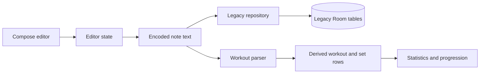
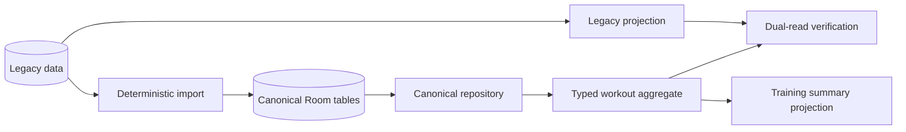
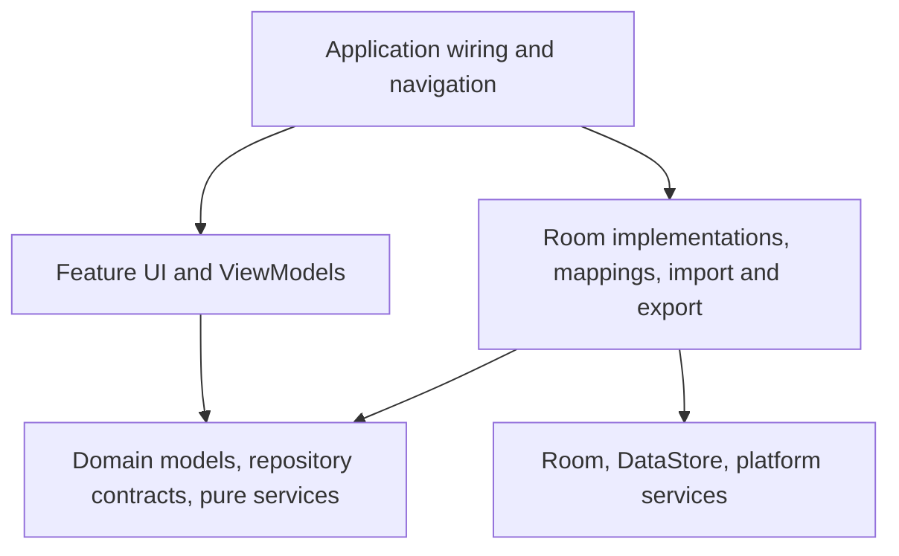
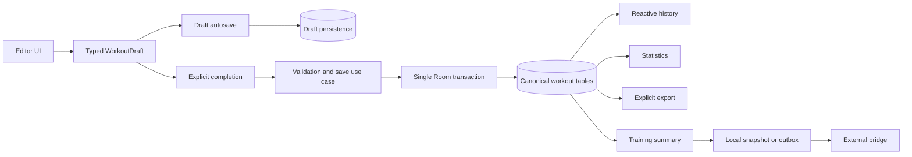

# GymTrack architecture

## Purpose

This document describes durable system boundaries, current data flows, and the target architecture. It does not track the active issue queue or implementation status.

Architecture changes should remain incremental, issue-driven, tested, and migration-safe.

## Stack and module strategy

| Concern | Implementation |
|---|---|
| Platform | Native Android |
| Language | Kotlin |
| UI | Jetpack Compose and Material 3 |
| Navigation | Navigation Compose |
| Storage | Room |
| Settings and lightweight state | Preferences DataStore |
| Concurrency | Coroutines and Flow |
| Charts | Compose Canvas |
| Dependency wiring | Manual application wiring and ViewModel factories |

GymTrack remains one Gradle application module. Package boundaries should be enforced before introducing additional modules.

## Package direction

```text
com.example.gymtrack/
├── app and navigation
├── domain/
│   ├── model/
│   ├── repository/
│   └── service/
├── core/
│   ├── data/
│   │   ├── canonical/
│   │   └── transition/
│   ├── time/
│   ├── ui/
│   └── util/
└── feature/
    ├── editor/
    ├── workouts/
    ├── stats/
    └── settings/
```

The package identity is a release concern and is intentionally separate from architecture layering.

## Current data flows

GymTrack currently supports a compatibility path and a canonical path.

### Note-oriented compatibility path



This path preserves existing behavior and data, but it has structural weaknesses:

- some timestamps and flags are encoded inside text;
- save operations can trigger parsing, statistics updates, and export together;
- statistics can depend on more than one representation;
- broad repair work can occur during startup;
- timer accuracy can depend on process or service behavior.

### Canonical path



The canonical path provides:

- stable workout, occurrence, set, exercise, alias, and category identities;
- explicit ordering and exercise modes;
- deterministic and idempotent legacy import;
- ambiguity reporting rather than silent guessing;
- domain aggregates isolated from Room entities;
- transactional aggregate persistence;
- verification between legacy and canonical projections;
- versioned compact summaries for external integrations.

## Canonical domain model

The accepted model is documented in [`docs/decisions/0002-canonical-workout-model.md`](decisions/0002-canonical-workout-model.md).

```text
Workout
- stable ID
- start and end timestamps
- category reference
- title and learnings
- lifecycle status
- compatibility raw text during migration

WorkoutExercise
- stable occurrence ID
- workout and exercise references
- explicit position
- explicit bilateral, unilateral, or superset mode

WorkoutSet
- stable set ID
- occurrence reference
- explicit position
- weight, repetitions, unit, and performed-time data

Exercise
- stable ID
- canonical name and aliases

Category
- stable ID
- name, color, position, and built-in state
```

Identity is separate from display timestamps. Ordering and flags are typed data rather than text conventions.

## Dependency direction



Rules:

- Compose UI does not access DAOs directly.
- ViewModels depend on domain contracts rather than Room entities.
- Room entities remain inside the data layer.
- Parsing, validation, verification, statistics, and summary projection are pure Kotlin where possible.
- Import, export, and external integration do not live inside Compose components.
- Android `Context` is accessed through application-safe abstractions.
- External transport failures cannot roll back canonical workout storage.

## Target runtime pipeline



Required properties:

- draft autosave is small, serialized, and independent of export or network access;
- explicit completion writes one consistent canonical workout;
- history and statistics read typed canonical data;
- export is explicit or scheduled, not an autosave side effect;
- startup does not reparse the full history;
- timer state is derived from persisted timestamps rather than a one-second accuracy loop;
- summaries are produced only after explicit completion;
- external systems receive stable, versioned summaries rather than becoming another source of truth.

## Creator OS boundary

GymTrack owns:

- detailed canonical workout data;
- versioned training-summary projection;
- a local snapshot or durable outbox after explicit completion.

The external Creator OS integration owns:

- transport from that local boundary;
- downstream upsert behavior;
- external retries and operational monitoring.

Active workout logging must not require a backend, Google Sheets, or network availability.

## Migration and compatibility policy

During the transition:

1. retain legacy rows and raw note text;
2. migrate deterministically and idempotently;
3. report ambiguous structure instead of inventing data;
4. compare legacy and canonical projections;
5. switch production reads and writes one path at a time;
6. keep a versioned, observable repair path when required;
7. remove legacy encodings and tables only after upgrade evidence is stable.

No migration may silently discard user data.

## Architecture Decision Records

Create or update an ADR when a change:

- changes the canonical data model;
- changes persistence, migration, backup, or restore strategy;
- changes import/export compatibility;
- introduces or removes a major dependency;
- changes module boundaries;
- creates a long-term platform or integration constraint.

ADRs live under `docs/decisions/` and contain context, options, decision, consequences, and status.
