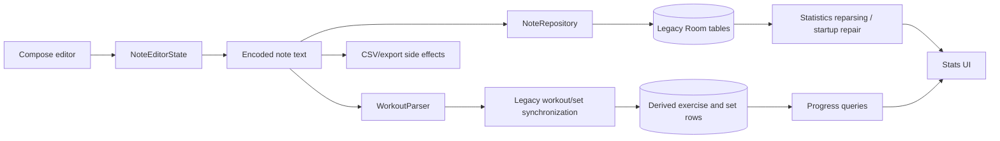
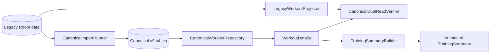
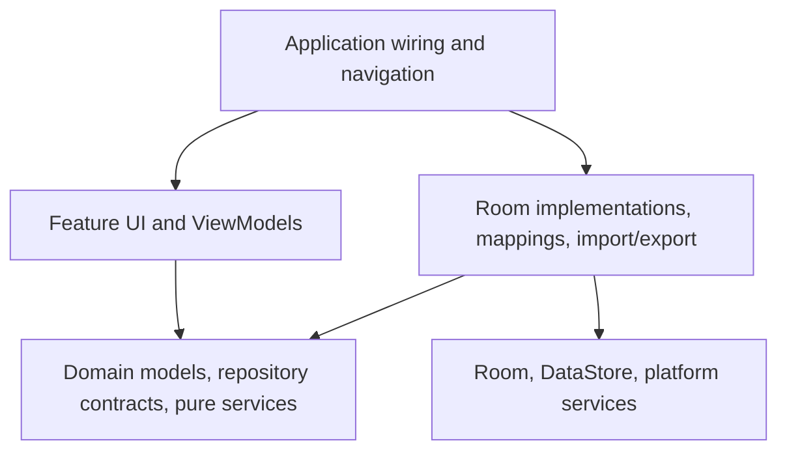
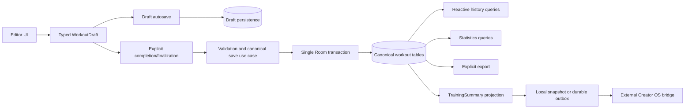

# GymTrack architecture

**Status:** transition architecture and target direction  
**Last reviewed:** 5 July 2026  
**Baseline:** `master` at `daa6adac766537ff84d2bcb331d3a5c840662abd`

## Purpose

This document describes the architecture that exists now, the compatibility paths that remain, and the intended dependency and data-flow direction. It is not permission for a large rewrite. Changes must remain incremental, issue-driven, tested, and migration-safe.

## Current stack

| Concern | Current implementation |
|---|---|
| Platform | Native Android |
| Language | Kotlin |
| UI | Jetpack Compose and Material 3 |
| Navigation | Navigation Compose |
| Primary storage | Room schema v9 |
| Settings | Preferences DataStore |
| Timer on `master` | Android foreground `shortService`; replacement is PR #128 |
| Concurrency | Coroutines and Flow |
| Charts | Custom Compose Canvas charts |
| Dependency wiring | Manual construction and ViewModel factories |
| Testing | JVM unit tests, lint/build CI, Room migration and emulator-backed integration tests |

The application remains one Gradle application module. A module split is not currently justified; package and dependency boundaries should be strengthened first.

## Current package shape

```text
com.example.gymtrack/
├── MainActivity.kt
├── NavigationHost.kt
├── core/
│   ├── data/
│   │   ├── canonical/
│   │   └── transition/
│   ├── services/
│   ├── ui/
│   └── util/
├── domain/
│   ├── model/
│   ├── repository/
│   └── summary/
└── feature/
    ├── editor/
    ├── home/
    ├── settings/
    └── stats/
```

The package identity remains `com.example.gymtrack`. Selecting a permanent identity and production release configuration is tracked by #124.

## Current transition state

GymTrack currently has two connected representations:

1. the legacy note-oriented runtime path used by active editor and compatibility behavior;
2. the canonical v9 model used for migration, repository access, verification, and compact summaries.

### Legacy active path



Current limitations:

- timestamps and exercise flags can still be encoded with invisible Unicode separators;
- autosave can trigger work beyond preserving draft state;
- multiple representations of a workout can disagree;
- startup still performs broad statistics repair work;
- the foreground timer uses a service type that is unsuitable for long workouts until PR #128 replaces it.

### Canonical v9 path already merged



Merged capabilities:

- explicit Room migration chain with destructive fallback removed;
- canonical workout, occurrence, set, exercise, alias, and category tables;
- deterministic and idempotent backfill from legacy data;
- ambiguity reporting rather than silent guessing;
- domain aggregates and repository interfaces isolated from Room entities;
- transactional canonical aggregate load/save support;
- deterministic ordering and dual-read verification;
- pure, versioned `TrainingSummary` projection from canonical `WorkoutDetails`.

The canonical path is a foundation, not yet a claim that every production read and write uses canonical data.

## Canonical model

The accepted model is documented in [`docs/decisions/0002-canonical-workout-model.md`](decisions/0002-canonical-workout-model.md).

Core concepts:

```text
Workout
- stable workout ID
- started and ended timestamps
- category reference
- title and learnings
- lifecycle/status metadata
- compatibility raw text during transition

WorkoutExercise / occurrence
- stable occurrence ID
- workout and exercise references
- explicit position
- explicit bilateral, unilateral, or superset mode

WorkoutSet
- stable set ID
- occurrence reference
- explicit position
- weight, repetitions, unit, and performed-time data

Exercise
- stable exercise ID
- canonical name and aliases

Category
- stable category ID
- name, color, position, and built-in state
```

Stable identity is separate from display timestamps. Ordering and flags are stored as typed fields rather than inferred from text.

## Dependency direction



Rules:

- Compose UI does not access DAOs directly.
- ViewModels depend on domain repository contracts rather than Room entities.
- Room entities remain inside the data layer.
- Parsing, verification, summary projection, and statistics calculations should be pure Kotlin where possible.
- Import/export and external integration do not live inside Compose components.
- Android `Context` is accessed through application-safe abstractions.
- Network or bridge failures must not roll back canonical workout storage.

## Target runtime pipeline



Expected properties:

- draft autosave is small, serialized, and independent of export or network access;
- explicit completion writes one consistent canonical workout;
- history and statistics read canonical typed data;
- export is explicit or scheduled, not a side effect of every autosave;
- startup does not reparse all workouts;
- compact summaries are generated only after explicit completion;
- the external bridge upserts by stable `workout_id` and is not a second GymTrack source of truth.

## Remaining transition work

### #153 — Training summary snapshot/outbox

Persist or enqueue one current summary per completed workout. Retries must be idempotent, autosave must produce no summary, and transport failures must remain isolated.

### #122 — Save-pipeline separation

Separate draft preservation, explicit finalization, statistics synchronization, and export. Prevent stale saves from overwriting newer editor state.

### #125 — Typed editor state

Replace hidden separator persistence with a typed `WorkoutDraft` and explicit row ordering, timestamps, and exercise modes while preserving legacy compatibility.

### #126 — Statistics cutover

Remove unconditional startup rebuild after normal mutation paths maintain canonical consistency. Preserve a versioned, observable repair path only if needed.

### #121 — Cleanup

Remove only source files and dependencies proven unused by search, compilation, tests, and smoke validation. Keep cleanup separate from behavior changes.

### #124 — Release architecture

Choose the permanent package identity, separate debug and release signing, define versioning, and document release validation before external distribution.

## Timer transition

PR #128 replaces the process-global foreground-service timer with persisted timestamp-derived state in Preferences DataStore. Automated checks pass, but it remains unmerged until Android 14+ manual background/process-restoration validation is recorded.

Until that PR merges, the service-based timer is still the runtime architecture on `master`.

## Creator OS integration boundary

GymTrack owns:

- canonical detailed workout data;
- versioned `TrainingSummary` projection;
- local snapshot or durable outbox after explicit completion.

The external Creator OS repository owns:

- transport from the local summary boundary;
- Google Sheets upsert;
- retries and operational monitoring outside GymTrack.

GymTrack must not require Google Sheets, a backend, or network availability for active logging.

## Migration and compatibility policy

Completed:

1. remove destructive migration fallback;
2. add explicit migration tests;
3. add canonical tables beside legacy tables;
4. backfill deterministically and idempotently;
5. expose canonical repositories and dual-read verification.

Remaining:

6. switch production reads and writes one path at a time;
7. investigate every verification mismatch;
8. retain legacy raw data for the documented compatibility period;
9. remove legacy encodings and tables only after upgrade evidence is stable.

No migration step may silently discard user data or infer ambiguous values without reporting them.

## Architecture Decision Records

Create or update an ADR when a change:

- changes the canonical data model;
- changes persistence, migration, backup, or restore strategy;
- changes import/export compatibility;
- introduces or removes a major dependency;
- changes module boundaries;
- creates a long-term platform or integration constraint.

ADRs live under `docs/decisions/` and include context, options, decision, consequences, and status.

## Documentation maintenance

Update this file after a phase-defining architecture merge. The baseline commit and absolute review date must change together. Live issue and pull-request state remains authoritative for implementation status.
